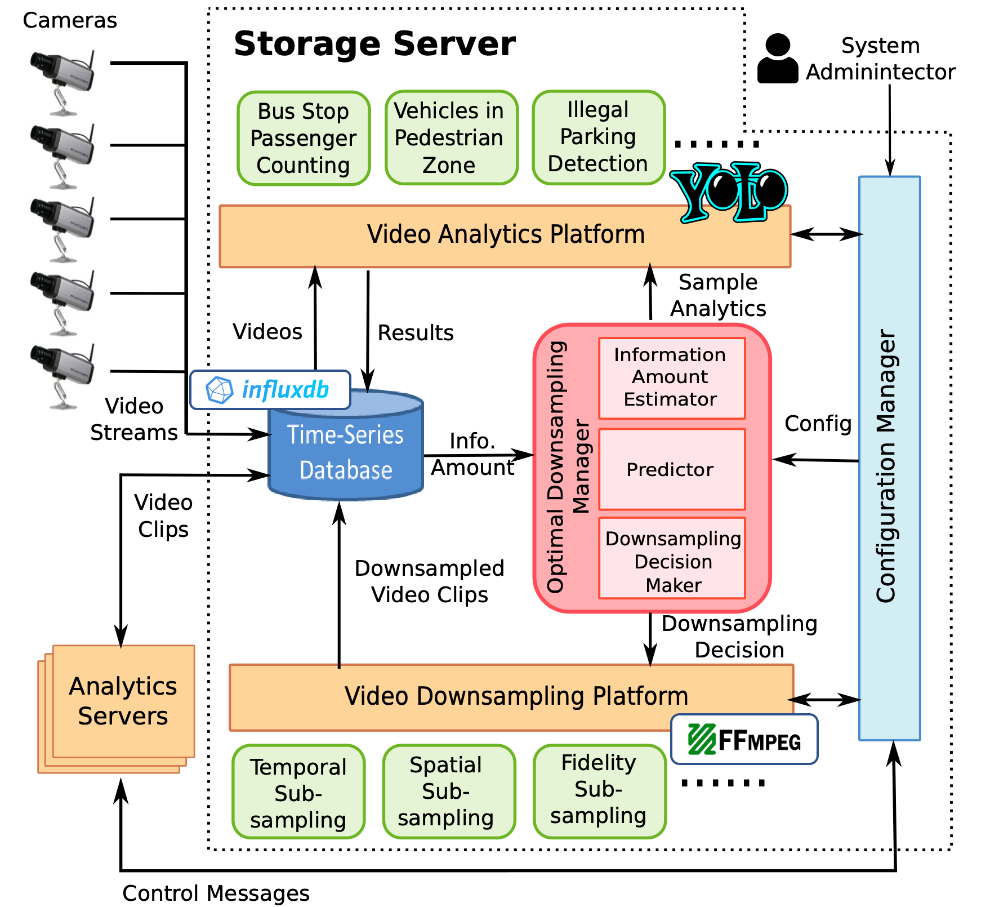
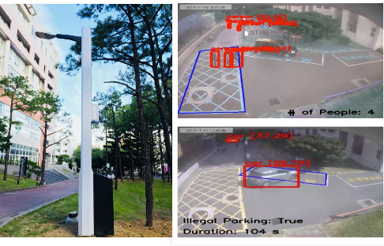
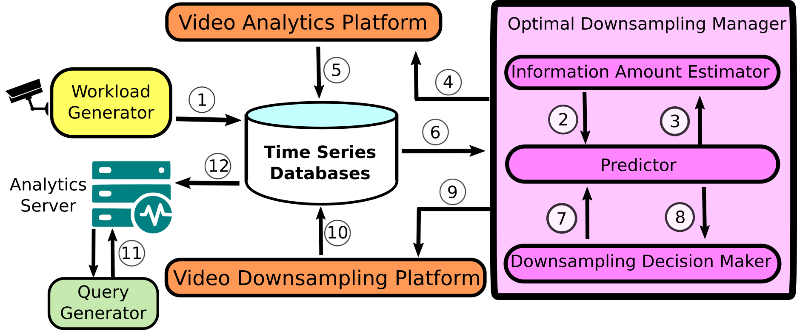
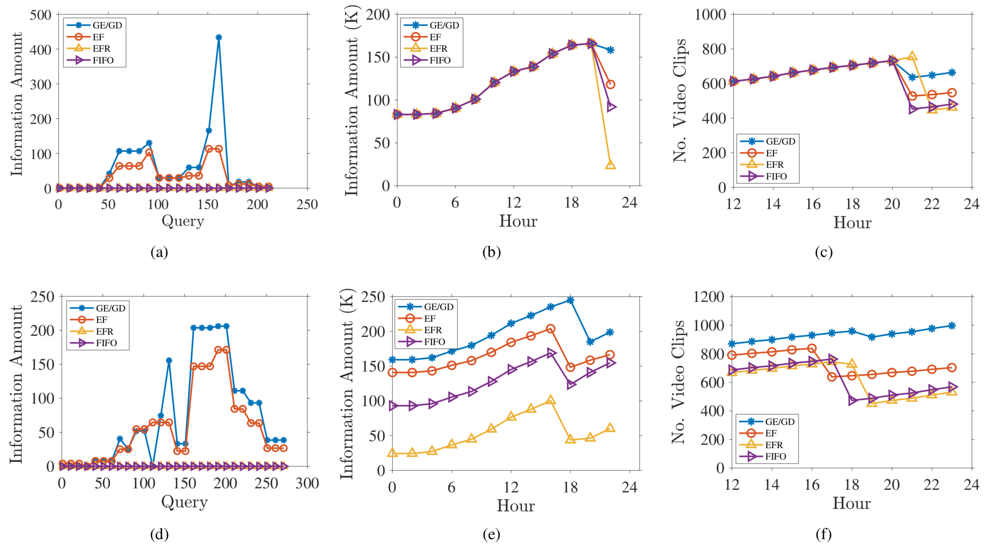

# Analytic-Aware Storage Server
This project aims to preserve the information amount of surveillance videos as much as possible under the limited storage space. We define the information amount, design two greedy algorithms, build a system. Our GE/GD algorithms decide the sampling lengths and downsampling decision intelligently.

You can quickly know our project by the [video link](https://youtu.be/m6V_BqjsRJU).

## System Overview

<p align="center">
  
</p>

## Requirements

- **Darknet**: Our analytic is based on Darknet which optimized by [Alexey](https://github.com/AlexeyAB/darknet) Please follow the installation in darknet. Or you can just use the [version](https://drive.google.com/drive/folders/1LX2TId-jA8QL4lZL1hpKS01ahGUeRtBk?usp=sharing) we have already compiled. Please put the folder *darknet* under *./analytics*
  - Ubuntu 18.04
  - CUDA 10.0
  - cuDnn 7.6.1
  - NVIDIA RTX 2060
- **InfluxDB=1.1.1**: We use [InfluxDB](https://www.influxdata.com/) as our time-series database in the system.
- **FFmpeg>=3.4.6**: In our downsampling platform, we apply ffmpeg command to control the bitrate and framerate of our testing videos. Note that we use hevc_cuvid as encoder and decoder so that we can utilize GPU to accelearte the downsampling. 
- **OpenCV>=3.4**
- **Virtualenv**: Please use virtual env to ensure the environment is clean. 
  To initialize a virtual env:
  ```
  python3 -m venv venv
  ```
  To start up a virtual env:
  ```
  source venv/bin/activate
  ```

## Dataset

We implement our solution in a real smart campus. The following figure depicts our testbed consists of eight street lamps close to the EECS building at NTHU, Taiwan. Four of the street lamps come with IP cameras: three fixed bullet camera and one PTZ (Pan-Tilt-Zoom) camera. In our preliminary experiments, we use the video from one of the cameras to evaluate our solution. The videos are capable conduct multiple analytics, such as people counting, illegal parking.

<p align="center">
  
</p>

## Prediction Table
The empirical analyzing and downsampling information are stored in influxDB. Please download the [backup](https://drive.google.com/open?id=1STrJc7lt8EozlRoWG_IVGFxFS5hgAXKM) to restore them. 
```
influxd restore -database nmsl -metadir /var/lib/influxdb/meta -datadir /var/lib/influxdb/data ./serverDB
sudo service influxdb restart
```
## Get Started
Our emulation following the flow chart below. Virtual Camera emulates the procedure which surveillance videos streaming to our storage server. Each of Video Analytics (Downsampling) Platfom, Information Amount Estimator, Downsampling Decision Maker is running as a process. 

<p align="center">
  
</p>

- To analyze the information of incoming video, please open the following components:

  Open Video Analyztics Platform:
  ```
    python3 start_analytic_platform.py
  ```
  Open Information Amount Estimator:
  ```
    python3 start_IAE.py
  ```
  Open Virtual Camera (switch mode to 1):
  ```
    python3 start_camera.py
  ```
- To reduce the sizes of preserved videos by the inforamtion amount contained. Please open the following components:

  Open Video Downsampling Platform:
  ```
    python3 start_downsample_platform.py
  ```
  Open Downsample Decision Maker:
  ```
    python3 start_DDM.py
  ```
  Open Virtual Camera (switch mode to 2):
  ```
    python3 start_camera.py
  ```

## Result

<p align="center">
  
</p>

The figure. (a) and (d) are the information amount of 2-nd and 3-rd days of query on the 6-th day. The figure (b) and (e) are the total preserved information amount change on 2-nd and 3-rd days. The figure. (c) and (f) are number of videos left in the storage server.

Our storage server and algorithms are effective for controlling the used space, analyzing and downsampling time. Moreover, the preserved information amount and number of video clips also outperform the current practices, such as First-In-First-Out, Equal-Fidelity, and Equal-Frame-Rate.


